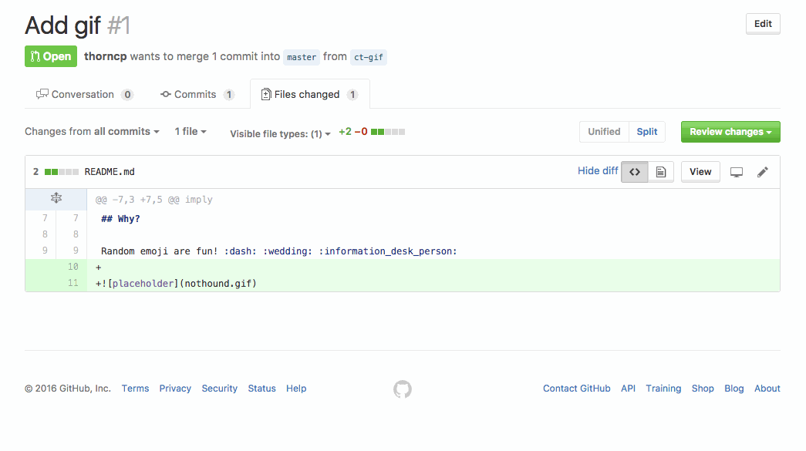

# Random PR Emoji

Selects a random emoji that's appropriate to be used while reviewing a pull
request. The set of emoji are ones I feel are positive or neutral. It's entirely
possible and very likely that some inappropriate emoji were looked over. Please
open an issue or a pull request if you encounter one!

## Why?

Random emoji are fun! :dash: :wedding: :information_desk_person:

